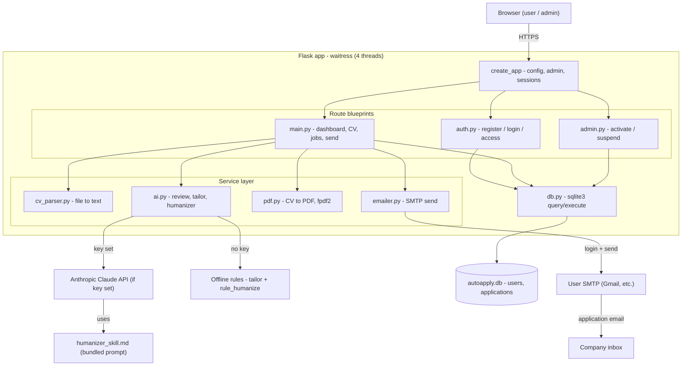

# AutoApply BW — Architecture

How the parts connect, from the browser down to the database and external services.
Open this file in VS Code and use the Markdown preview (Ctrl+Shift+V) to see the
diagram rendered.

## Key design points

1. **One app, three blueprints.** `auth` = identity + access control, `main` = all
   user actions, `admin` = owner-only activation. Served by waitress.

2. **Thin service layer.** `cv_parser`, `ai`, `pdf`, `emailer` each do one job and
   are independently testable.

3. **The AI fork.** `ai.py` uses the Claude API with the bundled humanizer skill when
   `ANTHROPIC_API_KEY` is set; otherwise it runs the offline rule-based tailoring and
   `_rule_humanize`. Output shape is identical, so callers don't care which ran.

4. **Single source of truth.** Everything persists through `db.py` into one SQLite
   file (`users`, `applications`).

5. **Two external dependencies, both owner-controlled.** The Anthropic API (one key
   for all users) and each user's own SMTP inbox for sending (rate-limited per hour).

## Where the capacity limits live (and the mitigations in place)

- **waitress threads**: 16 by default (`WAITRESS_THREADS` to override) — requests
  are mostly I/O-bound waits, so this is cheap headroom over the old 4.
- **SQLite**: WAL mode + busy_timeout (app/db.py) — readers no longer block
  behind a writer; brief write contention waits instead of erroring.
- **Job search**: served from a per-source cache with a stampede lock; after the
  first search, a background thread re-fetches sources just before the 10-min
  TTL expires, so user searches never hold a request thread for a cold fetch.
- **Blocking AI calls** still hold a thread for seconds-to-a-minute — the main
  remaining ceiling. Mitigated by the thread count; a queue/worker model is the
  next step if AI traffic grows.
- **SMTP per-user daily caps** (Gmail ~500/day) — but this scales *with* users.
