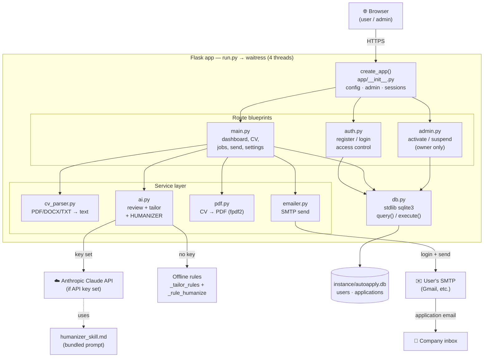

# AutoApply BW — Architecture

How the parts connect, from the browser down to the database and external services.
Open this file in VS Code and use the Markdown preview (Ctrl+Shift+V) to see the
diagram rendered.

## Key design points

1. **One app, three blueprints.** `auth` = identity + access control, `main` = all
   user actions, `admin` = owner-only activation. Served by waitress.

2. **Thin service layer.** `cv_parser`, `ai`, `pdf`, `emailer` each do one job and
   are independently testable.

3. **The AI fork.** `ai.py` uses the Claude API with the bundled humanizer skill when
   `ANTHROPIC_API_KEY` is set; otherwise it runs the offline rule-based tailoring and
   `_rule_humanize`. Output shape is identical, so callers don't care which ran.

4. **Single source of truth.** Everything persists through `db.py` into one SQLite
   file (`users`, `applications`).

5. **Two external dependencies, both owner-controlled.** The Anthropic API (one key
   for all users) and each user's own SMTP inbox for sending (rate-limited per hour).

## Where the capacity limits live

- **waitress 4 threads** → ~4 truly-concurrent requests.
- **SQLite single-writer** → write contention is the main ceiling under load.
- **Blocking Claude calls** (AI mode) hold a thread for seconds.
- **SMTP per-user daily caps** (Gmail ~500/day) — but this scales *with* users.
